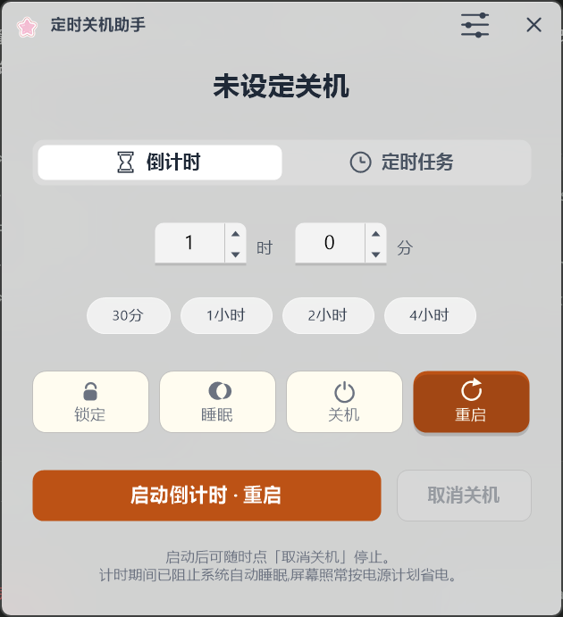
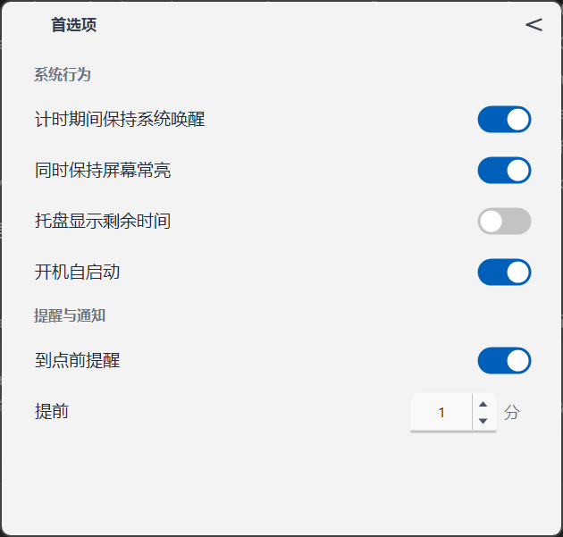

# 定时关机助手 · ShutdownTimer

Windows 托盘定时关机工具。设一个倒计时或指定时刻，到点自动执行**锁定 / 睡眠 / 关机 / 重启**。

给"挂着电脑"的人做的：挂下载、挂渲染、挂 AI 出图，到点自己收。单文件、免安装、无广告、**不联网**。



## 特性

- **两种触发**：倒计时（时/分步进输入，支持直接打字、滚轮、方向键、按住连发）与定时任务（自绘月历选日期 + 快捷加时）
- **四种动作**：锁定 / 睡眠 / 关机 / 重启，对齐 Windows 电源菜单语义，并记住上次用的
- **任务进行中锁定创建区**：只能暂停或取消，不会误改正在倒数的任务
- **防睡眠护航**：计时期间锁住系统不自动入睡（屏幕照常按电源计划省电），可单独开关"同时保持屏幕常亮"
- **托盘可视化**：悬停显示剩余时间，图标可选实时数字或进度环
- **开机静默自启**：开机后只进托盘，不弹任何窗口；需要时点图标
- **到点前提醒**：以 Windows 系统通知提示剩余分钟数，默认关闭
- **单实例**：再双击 exe 不会多开一个托盘图标，而是唤起已躲起来的那个
- **零依赖**：不引用任何 NuGet 包，全部能力走系统 API；单文件约 1.3 MB

## 下载

到 [Releases](releases) 页面下载 `ShutdownTimer.exe`（当前版本 v1.0.0）。

```
SHA256  24F9CF224C4628288C03075C00BFBAC2678C9CC10852061445227DBE4BBDDE84
```

需要 **.NET 8 桌面运行时**（Microsoft.WindowsDesktop.App 8.0.x）。若双击没反应并提示缺少框架，请先安装。

> 本程序未做代码签名，首次从浏览器下载运行可能弹 SmartScreen「Windows 已保护你的电脑」，点「更多信息」→「仍要运行」即可。可在 属性 → 常规 底部点「解除锁定」。

## 用法

1. 双击 `ShutdownTimer.exe` → 托盘出现星星图标。
2. 选模式并设时间，选到点动作，点「启动」。
3. 剩余时间在面板状态行与托盘悬停提示里可见。
4. 要改主意：点「暂停」冻结倒计时，或「取消关机」彻底取消。

设置项在面板右上角（滑块图标）里，改动即时保存：



## 数据与隐私

- 不发起任何网络连接，不读取你的文档内容，不上传任何东西。
- 设置存在 exe 同目录的 `settings.ini`（纯文本，可查可删）。
- 日志存在 exe 同目录的 `logs\st.log`（只记录动作、错误码与程序状态，超过 1 MB 自动轮转）。
- 开机自启是写入当前用户的注册表 `HKCU\...\Run` 项，指向本 exe 路径；在设置里关掉即删除。

## 已知限制

- **睡眠动作与现代待机（S0 低电量待机）**：支持 S0ix 的机器上，睡眠会断网并冻结后台任务。挂机下载/渲染请改用「锁定」，或开启「计时期间保持系统唤醒」。
- **到点立即执行，无二次确认窗口**：第一次使用建议先挂 1 分钟的「锁定」验证时间设置符合预期。
- 未保存的文档可能来不及保存就被关机（走的是系统关机流程，应用可自行拦截，但不保证）。

## 构建

需要 .NET 8 SDK。

```
dotnet publish -c Release -r win-x64 --self-contained false `
  -p:PublishSingleFile=true -p:IncludeNativeLibrariesForSelfExtract=true -o dist
```

产物 `dist\ShutdownTimer.exe`。开发期直接 `dotnet build -c Release` 即可，零外部依赖。

## 技术要点

整窗自绘：`Form` 内无任何子控件，`OnPaint` 用 GDI+ 画下全部界面，交互靠"矩形命中区表"分发。这样做是为了配合 DWM 亚克力背景（子控件会让 ClearType 文字被玻璃冲淡）。缩放自管（`DeviceDpi/96`，字体按像素构建），高 DPI 与多显示器下不发虚不错位。图标为内置 SVG path 数据经自写解析器转 `GraphicsPath`，不引入光栅资源。

## 许可

GPL-3.0，详见 [LICENSE](LICENSE)。
